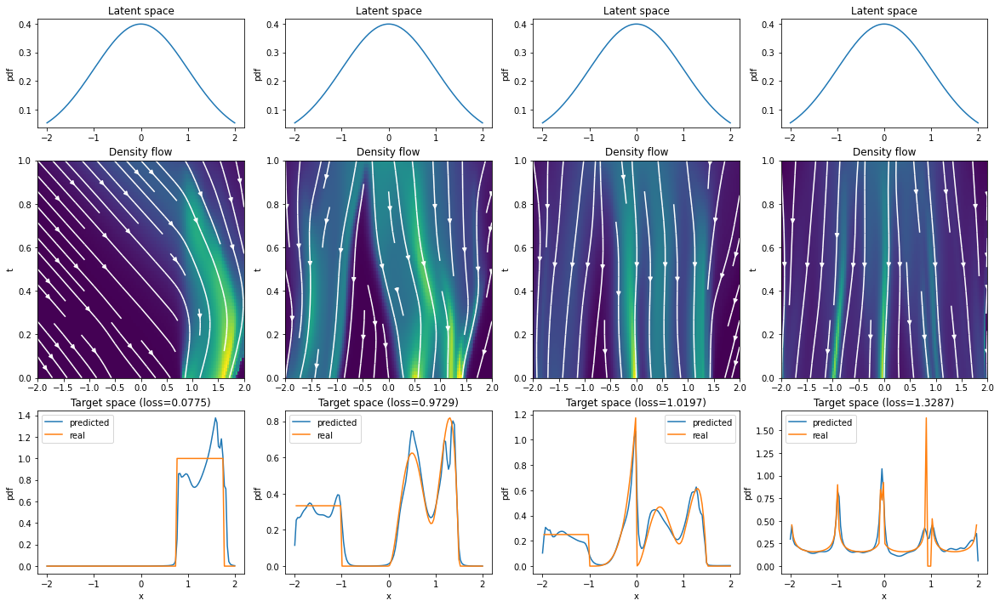
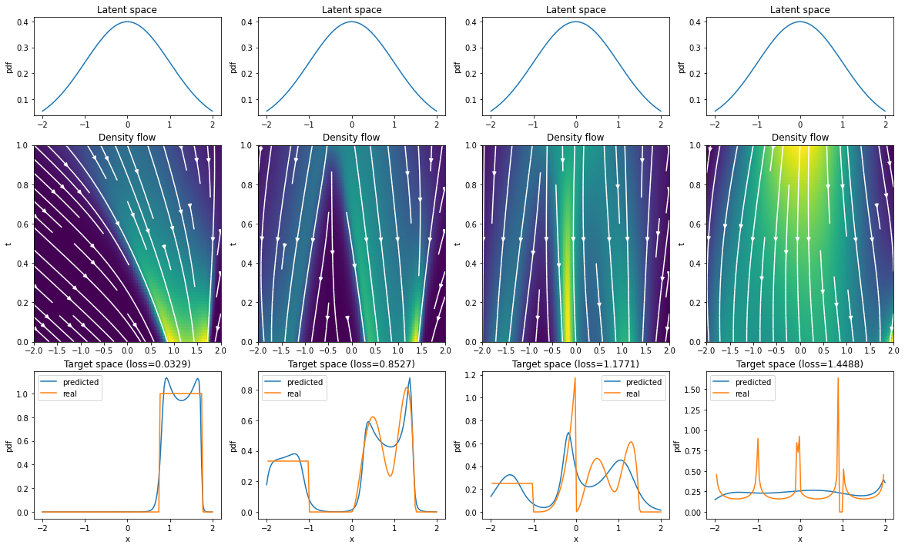
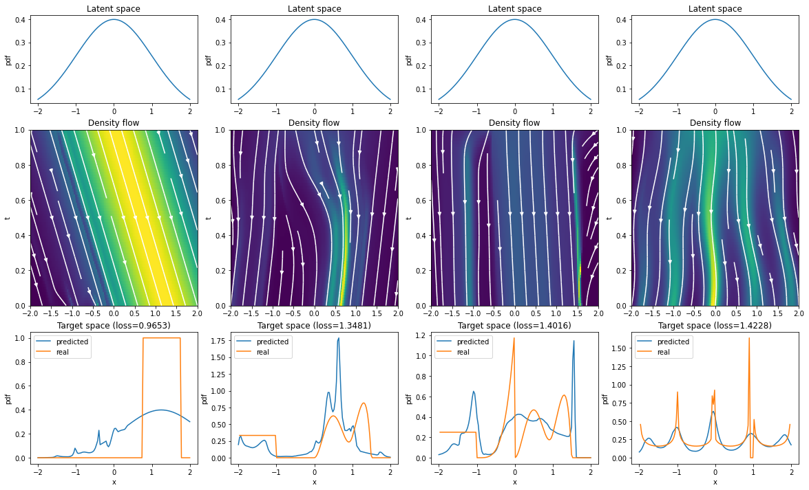

# Visual investigation into Reversible Generative Models
This repository was inspired by [FFJORD: Free-form Continuous Dynamics for Scalable Reversible Generative Models](https://arxiv.org/abs/1810.01367),
especially by the figure from the very beginning of the paper:  

I aimed to create additional visual examples to demonstrate how a neural ODE can 
transform probability distributions over time. Please note that this repository 
is focused on visualizing the neural ODE model rather 
than on evaluating its performance quantitatively. For a more detailed evaluation of the 
possible performance of models like this, please refer to the original FFJORD paper.

Using the notebook located in this repo, you can generate similar images. I decided to
use the [beta distribution](https://en.wikipedia.org/wiki/Beta_distribution) to define
a target distribution for the model to learn, as it's quite flexible. Using it, I
specified 4 target distributions. Some of them are harder to learn, and some are easier.
After training a neural ODE for each distribution, we can achieve a result like this one:
  

The neural model used in this repository is similar to the ones used in the FFJORD paper. 
The main difference is that this model only includes a single flow, unlike the 
multi-scale architecture used in the FFJORD paper. This simplification limits the 
expressiveness of the model, but adding positional encoding can compensate for the lack 
of multiple flows.

# How to run the code
1. Open the Jupyter notebook using Google Colaboratory
2. Attach Google Drive (optional, needed only for a grid search of parameters) 
3. Enjoy the working notebook!

# Experiments
Details on the training process can be found in the Jupyter notebook. The architecture 
for the neural ODE model used is as follows:

- The input to the model is positionally encoded by combining it with sine and cosine functions of varying frequencies.
- The model is composed of 3 linear layers with 8 neurons each, followed by Tanh activation functions.
- The final layer used a linear activation.

#### Best configuration
  
Training took 9 minutes.

#### Changing tolerance values
By default, a tolerance of 1e-4 was used in other experiments. Setting the tolerance 
lower (1e-9) has no visible effect on result quality:
  
But it took 49 minutes (instead of 9) to train the model! This works also the other way
around, as we can decrease training time to 4 minutes by setting a high tolerance
(1e-1). But high tolerance can lead to significant numerical errors, as 
visible in this visualisation:

  

#### Removing positional encoding
By default, input to the network is encoded using 4 frequencies of sin and cos functions.
Without positional encoding the results are significantly worse:
  
On the upside, it took only ~2.5 minutes to train the model.

#### Changing activation function
Replacing the default Tanh activation with ReLU negatively affects the 
result quality and training time (22 minutes).   

